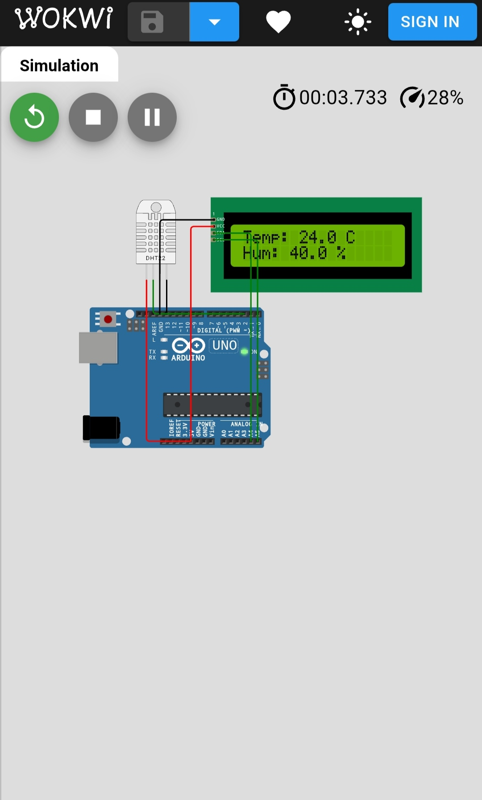

# Temp-Humidity-Monitor
Arduino project for monitoring temperature &amp; humidity using DHT22 and LCD (I2C).
# Temperature & Humidity Monitoring System (DHT22 + LCD)

This project measures temperature and humidity using the DHT22 sensor 
and displays values on a 16x2 LCD with I2C.

## Components
- Arduino Uno
- DHT22 Sensor
- 16x2 LCD with I2C
- Jumper Wires

## Circuit Diagram

## Code
See `temp_humidity_monitor.ino`

## Output
- LCD shows temperature in °C and humidity in %.
